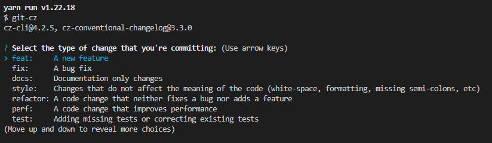
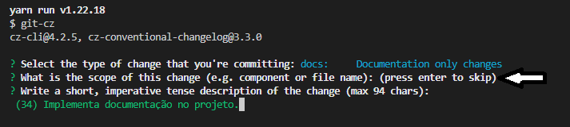
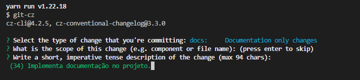
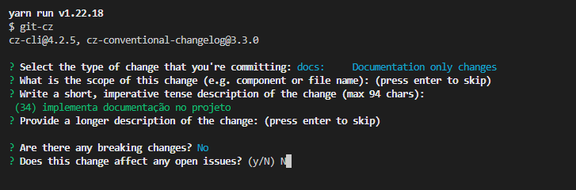
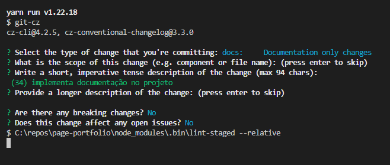

# Branches

As branches principais são:

- **main**
- **develop**

## Regras para novos desenvolvimentos:

- _feature/[nome-da-feature]/main_ - Para trabalhos relacionados a uma estória, derivar a branch a partir da **develop** com nome relacionado (Ex.: \*\*feature/tela-selecionar-local/main)
- _feature/[nome-da-feature]-[nome-da-tarefa]_ Para trabalhos relacionados a uma tarefa, derivar a branch a partir da **feature branch**, com nome relacionado (Ex.: _feature/tela-selecionar-local/configurar-api_)
- _hotfix/[nome-da-correcao]_ - Para trabalhos relacionados à correção de um bug/problema em produção, derivar a branch a partir da **main** com nome relacionado (Ex.: _hotfix/correcao-filtro-locais_)

### Observações

- Após integrar uma branch de **hotfix** na branch **main**, sempre integrá-la também na branch **develop**
- O time poderá sugerir mudanças nessas regras periodicamente
- Em casos específicos, o time pode decidir utilizar uma regra diferente que mais se atende à necessidade

## Clonar projeto

```shell
git clone https://github.com/g-aleprojetos-Projects/page-portfolio.git
```

## Commit

```shell
yarn run commit
```
<div style="background: black; padding: 12px;">
<h3>Deve escolher qual tipo vai ser o commit:</h3>
</br>
<p align="center" >
  <a href="https://unform.dev">
    
  </a>
</p>
</div>

<div style="background: black; padding: 12px; margin-top: 10px;">
<h3>Deve teclar enter no "scope":</h3>
</br>
<p align="center" >
  <a href="https://unform.dev">
    
  </a>
</p>
</div>

<div style="background: black; padding: 12px; margin-top: 10px;">
<h3>Deve preencher a mensagem do commit:</h3>
</br>
<p align="center" >
  <a href="https://unform.dev">
    
  </a>
</p>
</div>

<div style="background: black; padding: 12px; margin-top: 10px;">
<h3>No próximo deve preencher a descrição ou techar enter para passar:</h3>
</br>
<p align="center" >
  <a href="https://unform.dev">
    
  </a>
</p>
</div>

<div style="background: black; padding: 12px; margin-top: 10px;">
<h3>Nos dois últimos deve responder "N" para completar o commit:</h3>
</br>
<p align="center" >
  <a href="https://unform.dev">
    
  </a>
</p>
</div>


### Observações

- Após rodar os teste e não tiver problemas completar com :

```shell
git push
```
</br></br>
# Padrões de Código e Organização

- Será utilizado Typescript como linguagem de programação padrão.
- Os warning são tratados como erro.
- A formatação do código fonte é automatizada pelo Prettier (arquivo de configuração do plugin será versionado junto com o projeto).

## Estrutura de pastas do projeto

O nome das pastas estruturais do projeto devem iniciar com letra minúscula.

```text
  - components
  - pages
  - assets
```

A organização de arquivos do projeto será feita por **features**

- src
  - assets/
    - animations/
      - carregando.json
    - fonts/
      - minha-fonte.ttf
    - icons/
      - icon.svg
    - images/
      - minha-imagem.png
  - components/
    - Botao/
      - Botao.tsx
      - Botao.spec.tsx
      - Botao.styles.tsx
      - Botao.styles.spec.tsx
      - index.ts
  - context/
    - Qualidade/
      - Qualidade.reducer.spec.ts
      - Qualidade.reducer.ts
      - Qualidade.Actions.ts
      - Qualidade.context.spec.tsx
      - Qualidade.context.tsx
  - hooks/
    - useApi/
      - useApi.ts
      - useApi.spec.ts
  - infrastructure
    - api/
      api.ts
  - pages/
    - login/
      - LoginPage/
        - LoginPage.tsx
        - LoginPage.spec.tsx
        - LoginPage.styles.tsx
        - LoginPage.styles.spec.tsx
        - index.ts
    - execucao-servico/
      - criar-servico/
        - ElementoPepSuperiorPage/
        - AtividadePage/
      - IniciarServicoPage/
        - IniciarServicoPage.tsx
        - IniciarServicoPage.spec.tsx
        - index.ts
      - AcompanharServicoPage/
  - resources/
    - cores.ts
    - fonts.ts
  - routes/
    - App.routes.spec.tsx
    - App.routes.tsx
  - services/
    - ordemServico/
      - index.ts
      - ordemServico.service.spec.ts
      - ordemServico.service.ts
  - types/
    - enums/
      - Evento.ts
    - Atividade.ts
  - index.tsx
  - index.css

## Pastas

O nome das pastas dos componentes seguem o padrão **_Kebabcase_**

```text
  execucao-servico
```

## Componentes

O nome das pastas dos componentes seguem o padrão **_Pascalcase_**

```text
  Botao
```

O nome dos componentes seguem o padrão **_Pascalcase_** e deverão ter a extensão tsx do Typescript

```text
  OrdensDeServicoAbertasPage.tsx
```

Os componentes devem ser exportados como _default_ nos respectivos arquivos index.ts

```ts
import MeuComponente from './MeuComponente'

export default MeuComponente
```
ou

```ts
export * from './MeuComponente'
```

## Interfaces

As interfaces no Typescript deverão começar com `I`. ex.: `OrdemDeServico`

```typescript
export interface IOrdemDeServico {
  nome: string
}
```

O arquivo de estilo deve possuir o mesmo nome do componente seguido de .styles.tsx:

```typescript
OrdensDeServicoAbertasPage.styles.tsx
```

### Testes

Os testes dos styled components serão feitos usando snapshot quando o estilo é fixo.

```typescript
import React from 'react'
import 'jest-styled-components/native'
import {render} from '@testing-library/react-native'
import {Container} from './OrdensDeServicoAbertasPage.styles'

test('Container DEVE ser igual ao snapshot', () => {
  const container = render(<Container />).asJSON()
  expect(container).toMatchSnapshot()
})
```

```typescript
// OrdensDeServicoAbertasPage.styles.tsx
import styled from 'styled-components/native'

type ContainerProps = {
  primary: boolean
}

export const Container = styled.View<ContainerProps>`
  color: ${(props) => (props.primary ? 'blue' : 'red')};
`

// OrdensDeServicoAbertasPage.styles.spec.tsx
import React from 'react'
import 'jest-styled-components'
import 'jest-styled-components/native'
import renderer from 'react-test-renderer'
import {Container} from './OrdensDeServicoAbertasPage.styles'

describe('OrdensDeServicoAbertasPage.styles', () => {
  test('Container DEVE ter a cor vermelha QUANDO a propriedade primaria é definida', () => {
    const container = renderer.create(<Container primaria />).toJson()
    expect(container).toHaveStyleRule('color', 'red')
  })
})
```

Obs: O teste acima usa o _react-test-renderer_

Para executar os testes use o comando:

```shell
yarn test
```

## Ícones SVG

Antes importar os itens SVG do figma usar esse site https://jakearchibald.github.io/svgomg/ para otimizar o SVG.

> Obs: Deixar as configurações padrão e habilitar a opção Prefer viewBox to width/height

```typescript
import Logo from '@assets/images/logo.svg'

export default function MeuComponente() {
  return <Logo />
}
```
